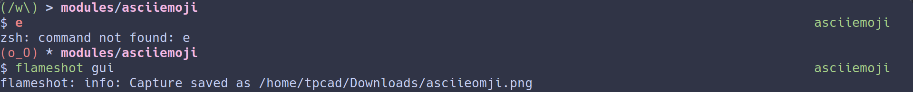

asciiemoji
=======

Based on [ericbn's minimal] prompt theme and inspired by [5m0k3r's halil] prompt
theme.

What does it show?
------------------

Left prompt:
  * The hostname only if current session is through a SSH connection.
  * The current activated python virtualenv.
  * An indicator displaying the following information:
    * User privilege: `#` when root, an emoji otherwise.
    * Last command success: indicator is set to USER_EMOJI_OK and it's color
      is set to OK_COLOR when the last command was successful, USER_EMOJI_ERROR
      and ERR_COLOR otherwise.
  * An indicator displaying the current keymap: INSERT_CHAR when in main or vi
    insert mode, NORMAL_CHAR when in vi command mode.
  * The last 2 components of the current working directory.

Right prompt:
  * The current git branch, when inside a git repo. Color is set to OK_COLOR if
    the branch is clean, ERR_COLOR if the branch is dirty. Mark is set to `!`
    when repo has unindexed files, `+` when repo has indexed files.

Settings
--------

This theme can be customized with the following environment variables. If a
variable is not defined, the respective default value is used.

| Variable         | Description                               | Default value |
| ---------------- | ------------------------------------------| ------------- |
| OK_COLOR         | Color for successful things               | `green`       |
| ERR_COLOR        | Color for failures                        | `red`         |
| USER_EMOJI_OK    | Emoji for main and successful things      | `(/w\)`       |
| USER_EMOJI_ERROR | Emoji for failures                        | `(o_O)`       |
| INSERT_CHAR      | Character used for main or vi insert mode | `>`           |
| NORMAL_CHAR      | Character used for vi command mode        | `*`           |

Advanced settings
-----------------

You can customize how the current working directory is shown with the
[prompt-pwd module settings].

These advanced settings must be overridden after the theme is initialized.

Requirements
------------

Requires Zim's [prompt-pwd] module to show the current working directory, and
[git-info] to show git information.

[ericbn's minimal]: https://github.com/zimfw/minimal
[5m0k3r's halil]: https://github.com/5m0k3r/zsh-themes
[prompt-pwd module settings]: https://github.com/zimfw/prompt-pwd/blob/master/README.md#settings
[prompt-pwd]: https://github.com/zimfw/prompt-pwd
[git-info]: https://github.com/zimfw/git-info
